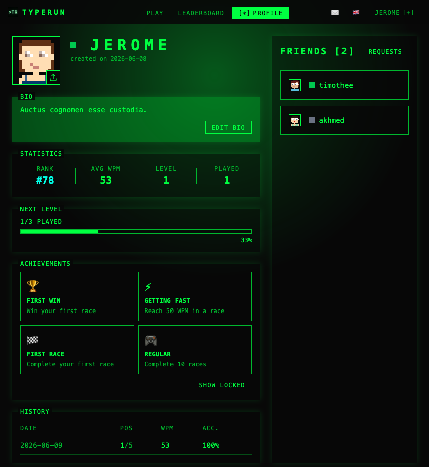
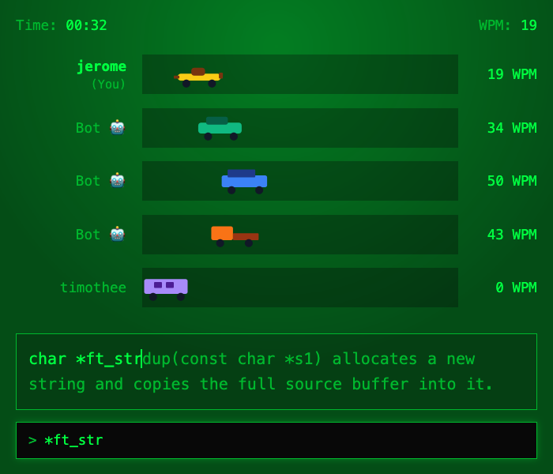

*This project has been created as part of the 42 curriculum by akdovlet, axbaudri, jbergero, kpires, trolland.*

# Typerun

Multiplayer real-time typing game built for the 42 group project ft_transcendence: full-stack web application using React, NestJS, WebSockets, PostgreSQL, Tailwind CSS, and Docker.


<table>
<tr>
<td></td>
<td></td>
</tr>
</table>

## Features

* **Game**: singleplayer and multiplayer (2+ players), bots, matchmaking, anti-cheat *(akdovlet)*
* **Friends**: send, accept, and decline friend requests; view friends list *(jbergero, kpires)*
* **Chat**: real-time direct messaging via WebSocket, with history and basic notifications for new messages *(jbergero, kpires)*
* **Leaderboard**: sortable and filterable rankings with pagination *(trolland)*
* **Profile**: avatar, bio, statistics, progress bar, achievements, match history *(jbergero, kpires)*
* **Settings**: change password, email, and default language *(axbaudri)*
* **Status**: real-time presence for users *(jbergero, kpires)*
* **Internationalization**: full English, French and Spanish translation using i18n *(kpires)*
* **Admin page**: user roles and basic administration page to manage quotes *(jbergero)*
* **Notifications**: complete notifications system *(jbergero)*

## Technical Stack

Written in TypeScript.

* **Frontend:** Vite, React
* **Backend:** NestJS (JWT authentication, rate limiting, WebSocket gateway)
* **ORM:** Prisma
* **Database:** PostgreSQL: chosen for its strong relational model (users, friendships, matches), transaction support, and native compatibility with Prisma
* **Reverse proxy:** Nginx
* **Containerization:** Docker, Docker Compose

## Instructions

### Prerequisites

* Docker
* Docker Compose

### Quick Start

Copy `.env.example` to `.env` and fill in the values before running any make command.

```sh
cp .env.example .env
```

#### Development

```bash
# build and start containers (dev)
make dev 
```

Go to [http://localhost:5173/](http://localhost:5173/)

#### Production

```bash
# build and start containers (prod)
make
```

The domain is set via `DOMAIN` in `.env`. Go to `https://$DOMAIN` and accept the self-signed certificate.

#### Cloudflare

Expose the app publicly via Cloudflare Tunnel.

```bash
make cloud # expose publicly via cloudflare
```

The URL is set via `CLOUDFLARE_DOMAIN` in `.env`. Go to `https://$CLOUDFLARE_DOMAIN`.


### Commands

| **Command**      | **Description**                    |
|------------------|------------------------------------|
| `make up`        | Build and start in production mode |
| `make dev`       | Start in development mode          |
| `make cloud`     | Start in cloud mode                |
| `make down`      | Stop all containers                |
| `make re`        | Rebuild in production mode         |
| `make redev`     | Rebuild in development mode        |
| `make recloud`   | Rebuild in cloud mode              |
| `make quotes`    | Add default quotes                 |
| `make seed`      | Seed the database                  |
| `make stress`    | Seed with a large data sample      |
| `make seedclean` | Remove seed data                   |
| `make clean`     | Clean build artifacts              |
| `make fclean`    | Full clean volumes (dangerous)     |
| `make logs`      | Show container logs                |
| `make ps`        | List container statuses            |

## Modules

List of implemented modules detailed in [docs/modules.md](./docs/modules.md).

## Team Information

| Member | Role | Responsibilities |
|--------|------|-----------------|
| akdovlet | Full-stack developer | UI/UX designer, Game Designer |
| axbaudri | Developer | Settings page (profile form with email & password change, API integration), privacy & terms page content, footer, and UX testing |
| jbergero | Full-stack developer, Product Owner (PO) | Establish priorities, validate work and features ; focus on frontend developement: build reusable components for the team, implement auth and features on the frontend |
| kpires | Full-stack developer, Technical Lead / Architect | Backend architecture and security, authentication systems (JWT, OAuth 42), WebSocket infrastructure, shell deployment scripts, and internationalization |
| trolland | Full-stack developer, Project Manager (PM) | Project coordination, DevOps (Docker dev/prod, deployment scripts, Cloudflare Tunnel), database seed, leaderboard with paginated search |

## Project Management

The team worked remotely with weekly to bi-weekly calls, daily communication on Discord and used multiple tools to organize and distribute work.

**Tools**

- Discord for messaging and calls
- Trello board for features planning (Backlog → To Do → Doing → Review → Done)
- Github Issues: for bugs and code-related tasks
- Github Wiki: internal documentation for component usage, API routes and development guidelines

## Individual Contributions

### axbaudri

* Settings page (form, api call): e-mail, password change, default language
* Redact privacy and terms page content
* Footer
* UX testing

**Challenge**: I joined this project with less experience than the rest of the team, which meant I had to learn while doing. Staying in sync with teammates was sometimes difficult, especially when things moved fast and decisions were made while I was still catching up. Working on UX testing helped me understand the project better: it forced me to communicate clearly, ask questions, and make sure I understood what had been built before I could validate it.

### akdovlet

* Game engine
* Game UI/UX
* Game component design
* Bots with randomized WPM
* Multiplayer matchmaking and game logic
* Server-side anti-cheat
* Set up virtual machine for evaluations

**Challenge**: Absorbing a lot of new concepts in a short time period, synchronization of players using websockets, race conditions, optimizing database queries, game theory, time management

### jbergero

* Bootstrap frontend (React, Vite, Tailwind), set up routing
* Design system: reusable components (Alert, Avatar, Btn, Container, Heading, Label, Input, TextArea, Text, List, Modal, Pagination...), color palette and layout components
* Auth: implement auth (context, forms, hook, api calls) on the frontend
* Profile, friends system: implement both features on the frontend (API calls, pages, components...)
* Achievements: frontend implementation, backend fixes
* Implement user roles and quotes system in backend and frontend
* Status system: WebSocket frontend, backend fixes, context and hook
* Chat: WebSocket frontend implementation, UI/UX, basic notification system for new messages using WebSocket
* Github: CI actions setup, PR reviews, merges, conflict resolution
* Internationalization (i18n): create and edit some translation keys
* Database: made migrations and schema edits
* Various backend fixes and small features
* Wrote meeting summaries after each team call

**Challenge**: planning and structuring the project architecture to avoid conflicts, redundancy, and disorganization. I decomposed features into several components, wrote internal documentation, and restructured the frontend for clarity and maintainability.

### kpires

* Backend bootstrap (NestJS), JWT authentication, throttle rate limit, and security (Helmet, CORS, npm patches)
* DB creation, Prisma setup with migrations and schema edits
* Core REST API endpoints: auth, users, friends, leaderboard, settings, and achievements (with auto-unlock)
* Complete OAuth 42 implementation with backup password support
* WebSocket backend implementation for chat, status, and base game backend (with WS hardening and reconnection)
* API documentation (Swagger UI and AsyncAPI viewer)
* Avatar upload integration via Cloudinary
* Docker environment setup (dev/prod) and shell deployment scripts
* Internationalization (i18n) setup and complete frontend translations (EN/FR/ES)
* Frontend UI/UX: responsive design fixes, navbar redesign, matrix rain home page, chat improvements, and blocking mobile devices on game pages
* Frontend features: Leaderboard redesign, profile page (history table), and conditional settings UI (oauth password)
* Github: PR and issue reviewing

**Challenge**: WebSockets were a concept I understood in theory, but putting them into practice with NestJS turned out to be a whole different story: authentication, event handling, room management, and reconnection all had to be figured out from scratch. Working through the official docs and a lot of trial and error, i eventually built a real-time layer that powers the chat, game, and status features. It was one of the most rewarding parts of the project.

### trolland

* Create Discord server and setup Github bots (PR, issues)
* Initial project setup
* DevOps: Docker environment setup (dev/prod) and shell deployment scripts
* Cloudflare Tunnel integration for public access
* Database seed system
* Reusable paginated search bar with filters
* Miscellaneous fixes
* Github: setup repo, push rules for main branch, PR and issues reviewing

**Challenge**: The fast pace of this project was the main challenge. With everyone working simultaneously on different parts, it quickly became clear that without enforced code reviews, knowledge silos would form — especially since some of us, myself included, were new to web development. I set up mandatory PR reviews on main as a way to keep everyone in the loop and make sure beginners could learn from the code they were merging, not just the code they wrote. On top of that, personal issues pulled me away from the project at a critical moment, which required catching up quickly while others had moved forward.

## Resources

- [Conventional Commits](https://www.conventionalcommits.org/en/v1.0.0/)
- [React documentation](https://react.dev/)
- [Vite documentation](https://vite.dev/)
- [devhints.io cheatsheets](https://devhints.io/)
- [quickref.ME cheatsheets](https://quickref.me/)
- [Monkeytype](https://monkeytype.com/) and [Typeracer](https://play.typeracer.com/) for inspiration
- [w3schools](https://www.w3schools.com/)
- [Patterncraft](https://patterncraft.fun/) for CSS background
- [Tailwind CSS documentation](https://tailwindcss.com/docs/)
- [Oauth 42](https://api.intra.42.fr/apidoc/guides/web_application_flow)
- [Nest JS documentation](https://docs.nestjs.com/)
- [Create a type racer](https://mario-gunawan.medium.com/creating-typeracer-game-using-reactjs-part-1-c8e40280ee42) (blog post)

**AI usage**

- explain concepts
- help planning features development
- help fixing bugs
- repetitive tasks (translation to spanish and french, documenting routes)
- redact internal documentation (dev wiki) and proofreading

## Database Schema

Complete database schema in [docs/database.md](./docs/database.md).